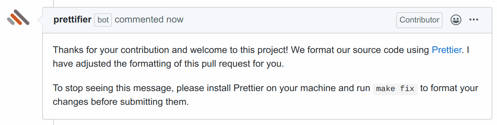

If you deal with a lot of contributions from strangers, for example as a
maintainer of a popular open-source project, you can find yourself explaining
the formatting guidelines in a lot of pull requests. Prettifier can automate
this by commenting on non-conforming pull requests.

Welcome Comments are disabled by default. You can enable them via the
[configuration file]({})

{} Prettifier adds one only welcome comment per pull request,
even if it fixes subsequent commits. {}
